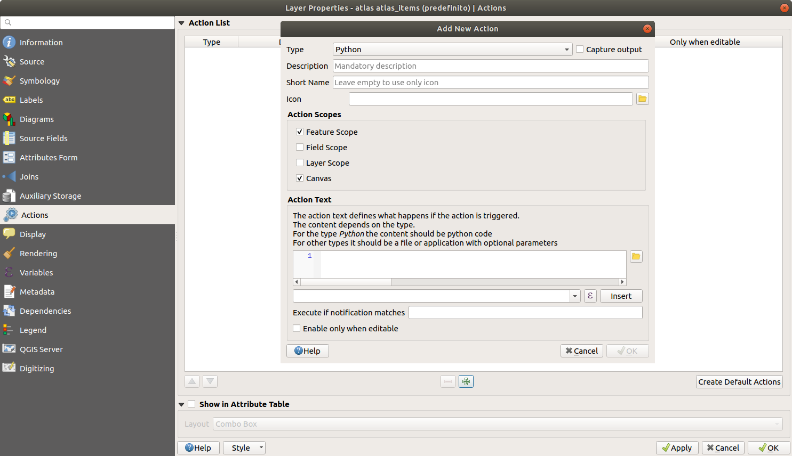
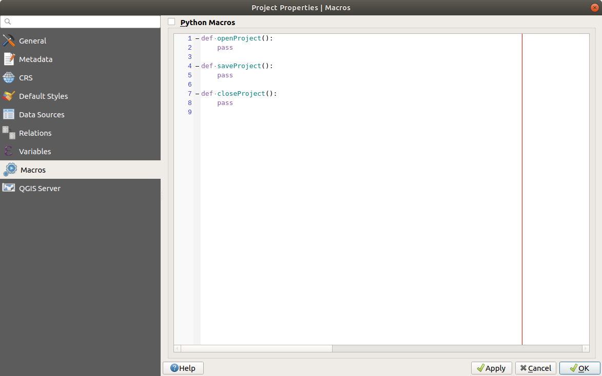
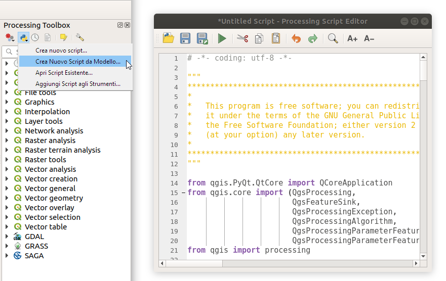

# PYQGIS

automazione python in QGIS

[(C)2019 CC-BY-SA](https://creativecommons.org/licenses/by-sa/3.0/it/) Enrico Ferreguti enricofer@gmail.com

--

## Python in QGIS

QGIS è un'applicazione open source multipiattaforma (è disponibile per tutti i principali sistemi operativi) costruita per mezzo del framework di programmazione Qt
QGIS espone per mezzo di un'interfaccia di programmazione (API) le classi ed i metodi di funzionamento,
Qt e QGIS dispongono di librerie di collegamento a PYTHON (*bindings*) denominate PyQt e PyQGIS che consentono il controllo e la personalizzazione  dell'applicazione per mezzo di codice interpretato in python

- QGIS2

  - Python 2.7/Qt 4

- QGIS3

  - Python 3.5/Qt 5

--

## Qt

Qt è un framework applicativo open-source sviluppato da Nokia per costruire interfacce utente grafiche (GUI) e sviluppare software. Qt è utilizzato in programmi come Google Earth, Virtual Box, Skype, Autodesk e Android. QGIS stesso è costruito con Qt. L'utilizzo di un framework applicativo come Qt velocizza il ciclo di sviluppo di un'applicazione e consente di sviluppare applicazioni multi-piattaforma.

### PyQt

il modulo di collegamento a QT (*bindings*) si chiama PyQt e può essere importato in un programma Python per controllare i widget dell'interfaccia utente ed eseguire comandi e funzioni personalizzate.
[moduli di Qt](http://doc.qt.io/qt-4.8/modules.html)
[API di PyQt](http://pyqt.sourceforge.net/Docs/PyQt4/modules.html)

### PyQGIS

Il modulo di collegamento a QGIS si chiama PyQGIS

[API di PyQGIS](#/3/2)

--

## Python in QGIS

- Console di python

  Python da riga di comando ed esecuzione di procedure utente.

- Creazione di funzioni personalizzate

  implementazione di nuove funzioni da usare nel calcolatore di espressioni

- Creazione di Azioni

  procedure associate ad interazioni con il layer sulla mappa e sulla tabella degli attributi.

- Macro a livello di progetto

  procedure automatiche in corrispondenza di determinati eventi a livello di progetto 

- Esecuzione di Algoritmi personalizzati di processing

  esecuzione di processi per mezzo del framework processing.

- Creazione di plugin specializzati

  Esecuzione di programmi complessi in python definizione dell'interfaccia utente.

--

### Console di python

si può attivare cliccando sul bottone con il simbolo python o dal menu plugins/


--

### Funzioni personalizzate


--

### Azioni



--

### Macro



--

### Algoritmi di processing



--

### Plugins


--

### directory di installazione

```console
QGIS2
[homedir]\.qgis2\python\plugins

QGIS3
[homedir]\.qgis3\python\plugins

QGIS3 - windows
[homedir]\AppData\roaming\QGIS3\python\plugins
```

- directory alternativa QGIS_PLUGINPATH in opzioni - ambiente

- installazione diretta da file zip (solo QGIS3)

--

## struttura minima di un plugin

La [struttura minima per un plugin](https://github.com/wonder-sk/qgis-minimal-plugin) prevede la presenza di due files, __init__.py e metadata.txt:

```python.py
from PyQt4.QtGui import *
from PyQt4.QtCore import *

def classFactory(iface):
    return MinimalPlugin(iface)


class MinimalPlugin:
    def __init__(self, iface):
        self.iface = iface

    def initGui(self):
        self.action = QAction(u'Go!', self.iface.mainWindow())
        self.action.triggered.connect(self.run)
        self.iface.addToolBarIcon(self.action)

    def unload(self):
        self.iface.removeToolBarIcon(self.action)
        del self.action

    def run(self):
QMessageBox.information(None, u'Minimal plugin', u'Do something useful here')
```

--

metadata.txt

```console
[general]
name=Minimal
description=Minimal plugin
version=1.0
qgisMinimumVersion=2.0
author=Martin Dobias
email=wonder.sk@gmail.com
```

... però la tipica installazione di un plugin è più complessa e prevede la suddivisione in moduli con la separazione tra logica QGIS e logica di interfaccia QT e si troveranno tipicamente i seguenti files:

```console
__init__.py               modulo di inizializzazione con plugin factory
immagini .png o .jpg      icone per l'interfaccia (button bar etc)
[modulo_principale].py    richiamato da plugin factory
[dialogo_principale].py   contiene la logica dell'interfaccia utente
[dialogo_principale].ui   contiene la definizione dell'interfaccia utente
resources.rc              talvolta contiene le risorse (immagini ed )
metadata.txt
```

---

# SCRIPT DI PROCESSING

--

## Gli algoritmi di processing

Processing è un'ambiente operativo di QGIS dove sono definiti degli algoritmi per la manipolazione di dati geospaziali. Il modello operativo su cui si basano è semplice:

- Definizione dei dati/layer/file di input e di eventuali altri parametri operativi

- Processamento/manipolazione dei dati

- Estrazione del risultato in un file/layer di output

--


--

## Personalizzazione degli algoritmi di processing

Il Framework processing può essere facilmente esteso aggiungendo degli strumenti definiti con script di python che possono usufruire di una serie di interfacce e di servizi con un minimo di codice.


[tutorial per QGIS2 - **SUPERATO**](http://www.qgistutorials.com/it/docs/processing_python_scripts.html)

[processing script in QGIS3](https://github.com/qgis/QGIS-Documentation/blob/c1c228eb8a3ab4c5f72ef10f323070f64dd23056/source/docs/user_manual/processing/scripts.rst#id61)

[Repertorio degli algoritmi predefiniti di QGIS3](https://github.com/qgis/QGIS/tree/master/python/plugins/processing/algs/qgis)

--

## Il nuovo stile di implementazione a "decoratori"

[Dataset di esempio](py/dataset.zip)
[processing__01.py](py/processing_01.py)

```python
# -*- coding: utf-8 -*-
from qgis.core import QgsProcessing, QgsWkbTypes
from qgis.processing import alg

#dichiarazione generale dell'interfaccia utente dell'algoritmo
@alg(name="duplica_layer", label="duplica layer", group="customscripts", group_label=alg.tr("Custom Scripts"))
#dichiarazione dei widget di input ed output
@alg.input(type=alg.SOURCE, name="INPUT", label="Input layer", types=[QgsProcessing.TypeVectorPolygon])
@alg.input(type=alg.NUMBER, name="AREA_MIN", label="Area minima")
@alg.input(type=alg.SINK, name="OUTPUT", label="Output layer")
@alg.output(type=str, name="OUT", label="Output")

def algoritmo_di_processing(instance, parameters, context, feedback, inputs):
    """
    corpo della procedura di processing
    """

    #raccolta dei parametri configurati dall'utente
    sorgente = instance.parameterAsSource(parameters, "INPUT", context)
    areaMinima = instance.parameterAsDouble(parameters, "AREA_MIN", context)
    (destinazione, dest_id) = instance.parameterAsSink(
        parameters,
        "OUTPUT",
        context,
        sorgente.fields(),
        sorgente.wkbType(),
        sorgente.sourceCrs()
    )

    #processing
    for feat in sorgente.getFeatures():
        geometry = feat.geometry()
        if geometry.area() > areaMinima:
            destinazione.addFeature(feat)

    #restituzione del risultato
    return {"OUTPUT": dest_id}
```

--

### Analisi dello script nei suoi elementi essenziali:

1. Dichiarazione della codifica del testo (UTF-8) con cui è scritto l'algoritmo (potremo usare lettere accentate..)

   ```
         # -*- coding: utf-8 -*-
   ```

2. Dichiarazione dei [moduli esterni](#/5/20) a disposizione dell'algoritmo

   ```python
   from qgis.core import QgsProcessing, QgsWkbTypes
   from qgis.processing import alg
   ```

   In questo momento ci basta sapere che l'interprete python "capisce" una serie limitate di parole chiave.

   - Alcune sono le dichiarazioni base del linguaggio "if, def, for...."

   - Altre sono parole chiave definite dall'utente (variabili)

   - Altre parole sono definite librerie esterne chiamate moduli da cui si può attingere per usare nel proprio programma delle librerie scritte da altri.

   - Alcune parole sono oggetti che hanno delle proprietà (attributi e metodi) accessibili per mezzo della separazione a puntini e quindi sono parole chiave definite dentro altre parole chiave

--

3. Dichiarazione generale dell'interfaccia utente dell'algoritmo

   ```python
   @alg(name="duplica_layer", label="duplica layer", group="customscripts", group_label=alg.tr("Custom Scripts"))
   ```

   - "name" è il nome interno ("slug" alfanumerico semplice")
   - "label" è  l'etichetta che compare nell'elenco degli algoritmi
   - "group" è il nome interno del gruppo ("slug" alfanumerico semplice")
   - "group_label" il il nome amichevole del gruppo che contiene l'algoritmo

4. Dichiarazione dei campi di input ed output

   ```python
     @alg.input(type=alg.SOURCE, name="INPUT", label="Input layer", types=[QgsProcessing.TypeVectorPolygon])
     @alg.input(type=alg.NUMBER, name="AREA_MIN", label="Area minima")
     @alg.input(type=alg.SINK, name="OUTPUT", label="Output layer")
   ```

     abbiamo molti [tipi di campi](https://docs.qgis.org/testing/en/docs/user_manual/processing/scripts.html#id1) a disposizione, oguno con parametri precisi da specificare. Nel nostro caso sono stati definiti 3 campi di input: sorgente di input in cui i valori del parametro types può avere [questi valori](https://qgis.org/api/classQgsProcessing.html#acad4d2322342455b53eee5701e2b3115), un parametro numerico, la specificazione della sorgente dati di destinazione

--

5. Definizione della funzione di processamento

   riferimento: [definizione di funzioni in python](#/2/16)

   ```python
   def algoritmo_di_processing(instance, parameters, context, feedback, inputs):
   ```

6. Definizione dell'Help dell'algoritmo

   ```python
       """
       corpo della procedura di processing
       """
   ```

--

8. Raccolta dei parametri configurati nell'interfaccia dell'algoritmo. i metodi disponibili sono elencati nell'API di [QgsProcessingAlgorithm](https://qgis.org/api/classQgsProcessingAlgorithm.html#ad8f3de369d3082a2da9498f6de838698)

riferimenti:  
- [assegnazione di variabili in Python](#/2/2) 
- [classi e oggetti in python](#/2/26) 
- [API di QGIS - feature campi e geometrie](#/3/6)

   ```python
       sorgente = instance.parameterAsSource(parameters, "INPUT", context)
       areaMinima = instance.parameterAsDouble(parameters, "AREA_MIN", context)
       (destinazione, dest_id) = instance.parameterAsSink(
           parameters,
           "OUTPUT",
           context,
           sorgente.fields(),
           sorgente.wkbType(),
           sorgente.sourceCrs()
       )
   ```

--

9. Il processamento vero e proprio dei dati.

   riferimento: [controllo del flusso in Python](#/2/12) 

       for feat in sorgente.getFeatures(): # iteratore per ogni feature contenuta nella

   ```python
           geometry = feat.geometry()
           if geometry.area() > areaMinima*10000:
               destinazione.addFeature(feat)
   ```

10. La restituzione del risultato

    ```python
    return {"OUTPUT": dest_id}
    ```

--

## Tipi di parametri

<!-- .slide: class="narrow" style="background-color:white"-->

| Tipi di parametri (sintassi estesa)                                                                               | Tipi di parametri (sintassi concisa) | Descrizione del campo                                                                    | Metodo di interpretazione in QgsProcessingAlgorithm                                                                                                                                                                              | Tipo di dato restituito                                                                 |
| ----------------------------------------------------------------------------------------------------------------- | ------------------------------------ | ---------------------------------------------------------------------------------------- | -------------------------------------------------------------------------------------------------------------------------------------------------------------------------------------------------------------------------------- | --------------------------------------------------------------------------------------- |
| [QgsProcessingParameterFeatureSource](https://qgis.org/api/classQgsProcessingParameterFeatureSource.html)         | alg.SOURCE                           | Campo Sorgente(INPUT) di dati vettoriale                                                 | [parameterAsSource()](https://qgis.org/api/classQgsProcessingAlgorithm.html#a545f024775b04ebe57b2dd0c0828d564)                                                                                                                   | [QgsProcessingFeatureSource](https://qgis.org/api/classQgsProcessingFeatureSource.html) |
| [QgsProcessingParameterFeatureSink](https://qgis.org/api/classQgsProcessingParameterFeatureSink.html)             | alg.SINK                             | Campo Destinazione(OUTPUT) di dati Vettoriale scrivibile come successione di QgsFeatures | [parameterAsSink()](https://qgis.org/api/classQgsProcessingAlgorithm.html#a6a6c42b8773f360db0e98c687b8d0636)                                                                                                                     | [QgsFeatureSink](https://qgis.org/api/classQgsFeatureSink.html)                         |
| [QgsProcessingParameterNumber](https://qgis.org/api/classQgsProcessingParameterNumber.html)                       | alg.NUMBER                           | Campo numerico                                                                           | [parameterAsInt()](https://qgis.org/api/classQgsProcessingAlgorithm.html#a2e144277ee0d8f024bef0c69aa619ab9) </br> [parameterAsDouble()](https://qgis.org/api/classQgsProcessingAlgorithm.html#a8b145f2517eeb2ce5e778ba87277ca48) | int </br> float                                                                         |
| [QgsProcessingParameterString](https://qgis.org/api/classQgsProcessingParameterString.html)                       | alg.STRING                           | Campo alfanumerico                                                                       | [parameterAsString()](https://qgis.org/api/classQgsProcessingAlgorithm.html#a8d0cc2e0cf232c20cf81cbf177aed185)                                                                                                                   | string                                                                                  |
| [QgsProcessingParameterPoint](https://qgis.org/api/classQgsProcessingParameterPoint.html)                         | alg.POINT                            | Campo Punto sul canvas                                                                   | [parameterAsPoint()](https://qgis.org/api/classQgsProcessingAlgorithm.html#ab76855abbc0d0f7960df45d2c11df83b)                                                                                                                    | [QgsPointXY](https://qgis.org/api/classQgsPointXY.html)                                 |
| [QgsProcessingParameterRasterLayer](https://qgis.org/api/classQgsProcessingParameterRasterLayer.html)             | alg.RASTER_LAYER                     | Campo layer raster in input                                                              | [parameterAsRasterLayer()](https://qgis.org/api/classQgsProcessingAlgorithm.html#a1acf6b180a53e944a81881a0d1f21d4c)                                                                                                              | [QgsRasterLayer](https://qgis.org/api/classQgsRasterLayer.html)                         |
| [QgsProcessingParameterVectorLayer](https://qgis.org/api/classQgsProcessingParameterVectorLayer.html)             | alg.VECTOR_LAYER                     | Campo layer vettoriale in input                                                          | [parameterAsVectorLayer()](https://qgis.org/api/classQgsProcessingAlgorithm.html#a6419a3d4c2c2e47d85304c586b736590)                                                                                                              | [QgsVectorLayer](https://qgis.org/api/classQgsVectorLayer.html)                         |
| [QgsProcessingParameterField](https://qgis.org/api/classQgsProcessingParameterField.html)                         | alg.FIELD                            | Campo scelta field                                                                       | [parameterAsFields()](https://qgis.org/api/classQgsProcessingAlgorithm.html#a533d86089c6f99daabaa53ae08a9b934)                                                                                                                   | list                                                                                    |
| [QgsProcessingParameterFolderDestination](https://qgis.org/api/classQgsProcessingParameterFolderDestination.html) | alg.FOLDER_DEST                      | Campo scelta directory                                                                   | [parameterAsFile()](https://qgis.org/api/classQgsProcessingAlgorithm.html#a5b892c72fa566d1654358b1f4f7c1350)                                                                                                                     | string                                                                                  |

La lista non è esaustiva. Ci sono molti altri tipi di [campi](https://docs.qgis.org/testing/en/docs/user_manual/processing/scripts.html#id1) e [metodi di interpretazione](https://qgis.org/api/classQgsProcessingAlgorithm.html#ad8f3de369d3082a2da9498f6de838698) disponibili ....

---

# Il linguaggio PYTHON

--

## Panoramica

- I tipi di dati

- le variabili

- i tipi strutturati

- il controllo del flusso di esecuzione

- funzioni, moduli e namespaces

- programmazione ad oggetti

#### THE ZEN OF PYTHON

```
>>> import this
```

--

# I TIPI DI DATI

--

## Numeri

```python
10     #integer (numero intero)
25.45    #float (numero decimale)

# Per trasformare una stringa in numero
# o troncare un float
int("10")
int(34.354)

# L'aritmetica ha una notazione convenzionale
10 + 1
10 * 5
10*(45/3)+8*17

# Divisione tra interi in python 2
5 / 2 #2

# se uno dei numeri è float il risultato è float
10 / 3.0

# questo è equivalente a sopra
10 / float(3)

# in python 3 il risultato è implicito
```

--

## Stringhe

```python
"Ciao da QGIS!"

# Concatenare le stringhe
"Ciao" + " " + "da QGIS!"

# Formattazione di stringhe
"Ciao da %s" % "QGIS!"

# Il testo è racchiuso da virgolette singole o doppie
'Python è "divertente"'

# Stringhe multi-linea
print ("""Questa stringa
è suddivisa in
varie righe""")

# Caratteri speciale come a capo, la tabulazione o la barra inversa,
# possono essere inseriti per mezzo di una sequenza di escape che inizia
# con una barra inversa "\"

print "Questa stringa\nviene stampata\nin tre righe"
print ("C:\Users\enrico")

# Si può usare una stringa grezza tralasciando le sequenze di escape
print ()r"C:\Users\enrico")

#Uso del set di caratteri esteso (unicode - UTF8) (Python 2)
print (u"questo è qgis")
```

--

## formattazione delle stringhe

il linguaggio dispone di [funzioni molto potenti](https://pyformat.info/) per assemblare tra loro le stringhe e formattare tipi non stringa (numeri, date)

```python
a = 'Paolo'
b = "Verdi"
c = 172
d = 8.5676776

# concatenazione
print (u"il mio cognome è " + b)
print ("mi chiamo "+a+" "+b+" alto "+str(c)+" cm ed ho percorso "+str(d)+" km")

# metodo "vecchio"
print (u"il mio cognome è %s" % b)
print ("mi chiamo %s %s alto %d cm ed ho percorso %.1f km" % (a,b,c,d))

#metodo "nuovo"
print ("mi chiamo {1} {0} alto {2:d} cm ed ho percorso {3:.1f} km".format(a,b,c,d))
```

--

## TIPO *Boolean*

```python
True

False (None, [], {})

# operatori
not True # False
True and True # True
True and False # False
False and False # False
False or True # True
not (True or False) and True #False

1 == 1 operatore di uguaglianza
1 != 1 operatore di diversità
2 > 1  maggiore
2 >= 1  maggiore o uguale
1 < 2  minore
1 <= 2  minore o uguale
```

--

## VARIABILI

```python

anno = "2017"

anno = 2017

print (anno)

anno_scorso = anno - 1

print (anno_scorso)
```

Le variabili in python hanno non sono "staticamente tipizzate", non devono essere dichiarate prima di usarle ne deve essere dichiarato il tipo. Sono dei contenitori che puntano a oggetti che potenzialmente possono essere di qualunque tipo. per conoscere il tipo dell'oggetto assegnato ad una variabile si usa type

```python
type(anno)
```

--

## I TIPI *STRUTTURATI*

--

## Liste

una lista (list) e' un elenco ordinato di elementi, iterabile.

```python
l = [3, 5, 4, 2, 1]
m = [[[0,3],[4,6],[5,7]],[[4,5],[6,8]]]

# Accesso agli elementi per posizione
# il primo elemento è 0, gli indici negativi partono dalla fine

l[0]       #3
l[0:3]     #[3, 5, 4]
l[-1]      #1
l[2:-2]    #[4, 2]
l[3:]      #[2, 1]
l[:-2]     #[3, 5, 4, 2]
m[0][2][0] #5
m[1][1]    #[6,8]
```

la stessa notazione è valida per ricavare sottostringhe

```python
"abcdefghijklmnopqrstuvwxyz"[-5:] # "vwxyz"
```

--

## Dizionari

un dizionario (dict) è un insieme strutturato di dati, iterabile.

```python
d = {
    "chiave1": 10,
    "chiave2": 234.56,
    "chiave2": "contenuto",
    "chiave3": {
        "chiave3_1": "abcdef",
        "chiave3_2": "xyz"
    }
}

d["chiave2"]               # 234.56
d["chiave3"]["chiave3_2"]  # "xyz"
```

--

## Manipolazione dei dati strutturati

```python
l0 = [] # lista vuota
l1 = [1, 2]
l2 = [3, 5, 6]

d0 = {} # dizionario vuoto
d1 = {"nome":"giuseppe", "anni": 50}

l1 + l2         # [1, 2, 3, 5, 6]
l1 + 4 + l3     # TypeError
l1.append(10)   # [1, 2, 3, 5, 6, 10]
l1.append(l2)   # [1, 2, [3, 5, 6]]
3 in l2         # True
3 in l1         # False
len(l1 + l2)    # 5

d1["cognome"] = 'verdi'
d1["anni"] = 60 # {"nome":"giuseppe","anni":60,"cognome":"verdi"}
d1.keys()       # ["cognome", "anni", "nome"]
d1.values()     # ["verdi", 60, "giuseppe"]
len(d1)         # 3
```

--

## Controllo del flusso

--

## IF THEN ELSE

```python
latitude = 51.5
if latitude >= 0:
   zone_letter = 'N'
else:
   zone_letter = 'S'

print zone_letter
```

- l'indentazione è il sistema con cui Python raggruppa le istruzioni

- L'indentazione viene realizzata con spazi o tabulazioni

- ogni riga all'interno di un blocco base dev'essere indentata in ugual misura

- Usare un buon editor di testo per programmatori!

--

## Cicli

```python
#for ELEMENTO in ITERABILE(LIST, DICT)

for carattere in "abcdefg":
    print (carattere)

for numero in [3, 5, 4, 2, 1]:
    print (numero)

#while CONDIZIONE_VERA(TRUE)

testo = "abcdefg"
while testo:
    testo = testo[:-1]
    print (testo)
```

un ciclo può essere interrotto con `break`

e si può saltare un'iterazione con `continue`

--

## Gestione delle eccezioni

In python esiston due tipi di errori:

- errori di sintassi; che impediscono l'esecuzione di un programma

- errori *runtime* o eccezioni; che avvengono durante lo svolgimento del programma e che possono interrompere il flusso dello stesso o essere gestite per isolare il codice che potenzialmente potrebbe generarle ed adottare strategie alternative mirate.

```python
try:
    print (100/0) #provoca ZeroDivisionError: integer division or modulo by zero
except:
    print ("il codice contenuto in try provoca un errore")

try:
    print (100/0)
except Exception as e:
    print ("il codice contenuto in try provoca l'errore" + str(e))
```

--

## Funzioni, moduli e namespaces

--

## Funzioni esistenti (o predefinite)

le funzioni in python sono delle azioni di trattamento dei dati definite da un nome e degli argomenti da trattare separati da virgole e racchiusi tra parentesi. Le funzioni possono o meno restituire un valore di risposta.

```python
# Funzioni esistenti (o predefinite)
print("stampa il numero",4)
sorted([3, 5, 4, 2, 1])
len(l1 + l2)
type(a)
globals()
```

--

## Definizione della propria funzione

```python
def ZonaUtm(longitudine, latitudine):
    numero_zona = ((longitudine + 180) / 6) % 60 + 1
    if latitudine >= 0:
        lettera_zona = 'N'
    else:
        lettera_zona = 'S'
    return '%d%s' % (int(numero_zona), lettera_zona)
```

### Uso della funzione

```python
ZonaUtm(11.55,45)   # 32
```

--

## Namespaces

ogni oggetto in python *vive* all'interno di un blocco predeterminato di istruzioni, chiamato *namespace*e che idealmente corrisponde al livello di indentazione nel quale viene creato l'oggetto riferito agli oggetti *def* e *class*

All'interno di un programma possono coesistere numerosi namespaces separati tra loro in cui i nomi degli oggetti non sono in conflitto. Esiste almeno un namespace globale che contiene gli oggetti richiamabili da ogni parte del programma

```python
def funzione1():
    var = 100
    print (var)

var = 50
print (var)
funzione1()
```

output:

```python
50
100
```

```python
globals() #simboli accessibili globalmente
locals() #simboli privati accessibili localmente (all'interno di una funzione)
```

--

## test sui namespaces

```python
a = 0
b = 1
c = 2

def stampa (a, b, c):
    print ('a:',a,'b:',b,'c:',c)

def test1():

    def test2(a,b,c):
        a += 1
        b += 1
        c += 1
        stampa(a, b, c)

    a = 6
    b = 5
    stampa(a, b, c)
    test2(a, b, c)

test1()
stampa(a, b, c)
```

--

## Moduli

I moduli sono collezioni strutturate ed organizzate di codice python le cui definizioni possono essere importate all'interno di un programma

```python
# Importa un modulo con chiamata ad una funzione contenuta
import math
math.floor(10.6)

# Importa singoli elementi da un modulo
from os import path
path.join('C:', 'Utenti', 'paolo', 'documenti')
'C:/Utenti/paolo/documenti'
```

l'organizzazione modulare è una delle caratteristiche del linguaggio. I moduli possono essere:

- predefiniti, già compresi nella [dotazione di base del linguaggio](https://docs.python.org/3/library/index.html)

- esterni, contenuti nei path di sistema di Python (PATH, PYTHONPATH). Possono essere preimportati o [importati da internet](https://pypi.python.org/pypi?%3Aaction=browse) tramite pip/setuptools

- definiti localmente dall'utente in altri files python

--

## Uso dei moduli esterni

E' possibile usare moduli esterni configurando opportunamente la variabile d'ambiente PYTHONPATH in modo che essa punti ad una cartella contente il codice del modulo

Oppure si può depositare manualmente la cartella contente il modulo python dentro la cartella "site-packages"

A sua volta il modulo può dipendere da altri moduli python.

La comunità Python ha organizzato un repository dei moduli correntemente utilizzabili da python: https://pypi.python.org/pypi Il repository è utilizzabile tramite il comando [pip](https://pip.pypa.io/en/stable/installing/)

```
pip install [nome pacchetto]
```

Il comando provvede ad installare il pacchetto desiderato insieme alle sue dipendenze nella versione stabilita dai *"requirements"* del modulo, aiutando il programmatore a superare i conflitti tra versioni diverse dei pacchetti installati.

--

## Decoratori

In Python le funzioni sono considerate esse stesse degli oggetti infatti:

```
>>> math.sin
```

e questo significa che:

- Possono essere passate come argomenti ad altre funzioni

- Possono essere definite all'interno di altre funzioni ed essere restituite come output di funzione

I Decoratori sono strumenti molto utili in Python che permettono ai programmatori di modificare il comportamento di una funzione o di una classe. I decoratori consentono di incapsulare una funzione dentro l'altra modificando il comportamento della funzione incapsulata senza modificarla permanentemente.

--

### Sintassi dei decoratori

Nel codice seguente mio_decorator è una funzione *callable* ovvero chiamabile, invocabile, che aggiungerà l'esecuzione di qualche codice all'etto dell'esecuzione della funzione XYZ

```python
@mio_decorator
    def XYZ():
    print ( "XYZ" )
```

ed equivale alla seguente funzione

```python
def XYZ():
    print("XYZ")

hello_decorator = mio_decorator(hello_decorator)
```

--

Per esempio con un decoratore si può calcolare il tempo di esecuzione di una funzione:

Attenzione il nome riservato `args `restituisce la lista degli argomenti passati a quella funzione e `*` trasforma una lista in una sequenza di argomenti mentre il nome riservato `kwargs `restituisce la lista degli argomenti opzionali (*key-worded arguments*)passati a quella funzione e `**` trasforma una lista in una sequenza di argomenti opzionali. e la costruzione `*args, **kwargs` significa tutti gli argomenti che una funzione potrebbe avere

```python
# importing libraries
import time
import math

def calcola_tempo_esecuzione(func):

    def funzione_incapsulante(*args, **kwargs):

        begin = time.time()
        valore_ottenuto = func(*args, **kwargs) #se la funzione ritorna un valore si conserva per restuirlo poi
        end = time.time()
        print("Tempo totale di esecuzione della funzione", func.__name__, end - begin)
    return valore_ottenuto

    return funzione_incapsulante


@calcola_tempo_esecuzione
def fattoriale(num):

    # imponiamo una pausa di due secondi per poter rendere evidente il tempo
    time.sleep(2)
    print(math.factorial(num))

fattoriale(10)
```

--

# Classi ed istanze

- Classe

  - tipo di dato composto definito dall'utente in metodi ad attributi.

- Istanziare

  - creare un'oggetto di una determinata classe.

- Istanza

  - un'oggetto creato che appartiene ad una classe.

- Membri di una classe

  - Metodi

    - funzioni che costituisce un comportamento dell'istanza

  - Attributi

    - valori attribuiti ad un'istanza.

- Costruttore

  - metodo usato per definire nuovi oggetti.

--

## definizione di classe e membri

```python
class rettangolo:

   l = 0
   h = 0

   def __init__(self, l, h):
      self.l = l
      self.h = h

   def area(self):
      return self.l*self.h

   def perimetro(self):
      return(self.l+self.h)*2

   def scala(self, scala):
      self.l = self.l*scala
      self.h = self.h*scala
```

--

## instanziare una classe

Una volta definita una classe è possibile .....

```python
 r = rettangolo(10,5) #istanziazione di un oggetto rettangolo
 r.area()             #50
 r.scala(2)
 r.perimetro()        #60
 r.l                  #20
 r.h                  #10
```

--

## Ereditarietà

è la capacità di definire una nuova classe come versione modificata di una classe già esistente

```python
class stanza:

    def __init__(self, lung, larg):
        self.lung = lung
        self.larg = larg
        self.nome = "stanza"
    def nome(self):
        return self.nome
    def area(self):
        return self.lung * self.larg

class cucina(stanza):

    def __init__(self, lung, larg):
        super().__init__(lung, larg)
        self.nome = "cucina"

class camera(stanza):

    def __init__(self, lung, larg, abitante):
        super().__init__(lung, larg)
        self.nome = "bagno"
        self.abitante = abitante

class edificio:

    def __init__(self, stanze):
        self.stanze = stanze

    def area_tot(self):
        area = 0
        for stanza in self.stanze:
            area += stanza.area()
        return area

    def abitanti(self):
        ab = 0
        for stanza in stanze:
            if hasattr(stanza,'abitante'):
                ab += 1
        return ab
```

--

## ispezione degli oggetti

individuazione del tipo di oggetto

```python
type(oggetto)
```

lista dei membri di un' oggetto

```python
dir(oggetto)
```

restituzione di un attributo di un oggetto con il suo nome

```python
getattr(oggetto,'membro')
```

test se un attributo è presente nell'oggetto

```python
hasattr(oggetto,'membro')
```

---

# API PyQgis

--


[diagramma](https://raw.githubusercontent.com/webgeodatavore/qgis-class-diagram/master/diagramme_principal.png)

--

## PyQGIS - classi fondamentali

[API in C++](https://qgis.org/api) - [API in python](https://qgis.org/pyqgis/) - [pyqgis per esempi](https://github.com/webgeodatavore/pyqgis-samples)

- [QgisInterface](https://qgis.org/api/classQgisInterface.html): riferimenti dell'interfaccia utente:

- [QgsProject.instance()](https://qgis.org/api/classQgsProject.html): gestisce l'oggetto progetto corrente.

- [QgsMapCanvas()](https://qgis.org/api/classQgsMapCanvas.html): è accessibile da QgisInterface().mapCanvas() e gestisce la visualizzazione dei layer: sistemi di riferimento, zoom/pan, mapTools etc...

- [QgsLayerInterface()](http://qgis.org/api/2.18/classQgsLegendInterface.html): accessibile da QgisInterface().layerInterface() gestisce la legenda dei layers

- [QgsMapLayer()](https://qgis.org/api/classQgsMapLayer.html): si articola in QgsVectorLayer() e QgsRasterLayer() e gestisce la manipolazione dei layers

- [QgsFeature()](https://qgis.org/api/classQgsFeature.html): gestione delle singole entità in geometria e attributi

- [QgsGeometry()](https://qgis.org/api/classQgsGeometry.html): permette la manipolazione delle geometrie

--

## QgisInterface

QGIS è programmato in modo modulare in C++ ed espone classi e metodi di funzionamento in PyQGIS

```
# iface è l'oggetto principale di QGIS da cui derivano
# tutti gli altri oggetti che ne permettono il funzionamento
# è un "singleton" un oggetto con unica istanza
# della classe QgisInterface, istanziato come oggetto iface
iface.activeLayer().name()

# la maggior parte dei metodi richiamano altri oggetti
iface.activeLayer()

# quali metodi o attributi per un'oggetto:
dir(iface.activeLayer())
```

https://qgis.org/api/classQgisInterface.html

--

## Caricamento di Progetti e Layers

- [caricamento di un progetto](https://docs.qgis.org/testing/en/docs/pyqgis_developer_cookbook/loadproject.html)

- [caricamento di un layer vettoriale](https://docs.qgis.org/testing/en/docs/pyqgis_developer_cookbook/loadlayer.html#vector-layers)

- [caricamento di un layer raster](https://docs.qgis.org/testing/en/docs/pyqgis_developer_cookbook/loadlayer.html#raster-layers)

- [inserimento di un layer nel progetto corrente](https://docs.qgis.org/testing/en/docs/pyqgis_developer_cookbook/loadlayer.html#qgsproject-instance)

```
project = QgsProject.instance() # l'oggetto è instanziato, viene usata l'istanza creata da QGIS
project.clear() #equivale a nuovo progetto
project.read('path ad un progetto')

vectorLayer = QgsVectorLayer('data_source', 'layer_name', 'provider_name') #provider_name = 'ogr' per sorgenti dati convenzionali
rasterLayer = QgsRasterLayer('data_source', 'layer_name', 'provider_name') #provider_name = 'gdal' per sorgenti dati convenzionali

QgsProject.instance().addMapLayer(vectorLayer) #QgsMapLayerRegistry

#procedura per listare i layers presenti
for layerName,layer in QgsProject.instance().mapLayers().items():
    print(layerName, layer.name(),layer.extent())
```

--

## Layers Vettoriali - accesso alle features

[Uso dei layers vettoriali](https://docs.qgis.org/testing/en/docs/pyqgis_developer_cookbook/vector.html#)

```
#CARICAMENTO
layer = QgsVectorLayer('data_source', 'layer_name', 'provider_name') #caricamento
layer = iface.activeLayer() #layer correntemente attivo sulla legenda

#PROPRIETA' DEL LAYER
print (layer.extent()) #estensioni del layer

for field in layer.fields():
    print (field.name(), field.typeName()) #stampa dei campi del layer

#ITERAZIONE
for feature in layer.getFeatures(): #tutte le feature del layer
    #qualinque azione da iterare per ogni feature

for feature in layer.selectedFeatures(): #tutte le features attualmente selezionate
    #qualinque azione da iterare per ogni feature

exp = QgsExpression("toponimo ILIKE '%lago%'")
request = QgsFeatureRequest(exp)
for feature in layer.getFeatures(request): #solo le feature che corrispondono all'espressione
    #qualinque azione da iterare per ogni feature
```

--

## Layers Vettoriali - oggetto QgsFeature

[QgsFeature()](https://qgis.org/api/classQgsFeature.html): gestione delle singole entità in geometria e attributi

```
#PROPRIETA'
feature.geometry() # la geometria legata alla feature (QgsGeometry)
feature['toponimo'] # accesso al campo "toponimo"
feature[3] # accesso al terzo campo
feature.id() #identificativo interno univoco ($id in espressioni)

#CREAZIONE
feature = QgsFeature() #creazione di una feature vuota senza definizioni dei campi #bisogna crearli ex novo
feature = QgsFeature(layer.fields()) #creazione di una feature contente i campi del layer

#MODIFICA
feature.setAttribute('area', 100.0) #settaggio del campo 'area' con il valore 100.0
feature.setAttribute(4, 100.0) #settaggio del quarto campo con il valore 100.0
feature.setGeometry(QgsGeometry.fromPointXY(QgsPointXY(123, 456)))
```

--

## Layers Vettoriali - modifica

```
#PREPARAZIONE ALLE MODIFICHE
layer.startEditing() #preparazione dell'edit buffer per la registrazione delle modifiche

#NUOVE FEATURES
layer.addFeature(feature)

#CANCELLAZIONE FEATURES
layer.deleteFeature(feature.id())

#MODIFICA FEATURES ESISTENTI
layer.changeGeometry(fid, geometry)
layer.changeAttributeValue(fid, fieldIndex, value)
oppure una volta ottenuta la feature desiderata
feature.setAttribute('area', 100.0)
feature.setGeometry(QgsGeometry.fromPointXY(QgsPointXY(123, 456)))

#AGGIUNTA ATTRIBUTI
layer.addAttribute(QgsField("mytext", QVariant.String))

#CANCELLAZIONE ATTRIBUTI
layer.deleteAttribute(indice_campo)

#FINE DELLE MODIFICHE
layer.commitCHanges() #scrittura sulla sorgente dati delle modifiche effettuate
layer.rollbackChanges() #cancellazione delle modifiche effettuate
```

--

## layers vettoriali - oggetto geometria

[QgsGeometry()](https://qgis.org/api/classQgsGeometry.html): permette la manipolazione delle geometrie

[geometria WKT - Well-Known Text](https://it.wikipedia.org/wiki/Well-Known_Text)

[geometria geojson](http://geojson.org/)


```
#METODI COSTRUTTORI
geom = QgsGeometry()
geom = QgsGeometry.    fromPointXY (QgsPointXY(12,45))

geom = QgsGeometry.fromWKT('POINT(12 45)')
geom = QgsGeometry.fromWKT('POLYGON((1 1,5 1,5 5,1 5,1 1),(2 2, 3 2, 3 3, 2 3,2 2))')

#MANIPOLAZIONE
geom2 = geom1.simplify(2.0)
geom3 = geom1.buffer(5)
geom4 = geom1.centroid()
geom5 = geom1.clipped(QgsRectangle(1,1,4,6))
geom6 = intersection(geom1)

#INTERROGAZIONE
geom1.isGeosValid() #verifica correttezza geometrica
geom1.intersects(geom2) #boolean True or False
geom1.contains(geom2)
geom1.within(geom2)
geom1.length() # Double lunghezza di un segmento
geom.distance(geom2) #double distanza minima tra due geometrie

#TRASFORMAZIONE
geom1.asWkt() trasformazione in WKT
geom1.asJson() trasformazione in oggetto geometria di geojson
```

---

# ESERCITAZIONI

--

## Output di file di testo (html)

Oltre ad elaborare i parametri in input per restituire un layer pronto all'uso in qgis, il framework processing consente di restituire anche altri tipi di output. In questo esempio restituisce un file html

[processing_02.py](doc/processing_02.py)

```python
# -*- coding: utf-8 -*-
from qgis.core import QgsProcessing, QgsWkbTypes
from qgis.processing import alg

#dichiarazione generale dell'interfaccia utente dell'algoritmo
@alg(name="dettagli_layer", label="dettagli layer", group="customscripts", group_label=alg.tr("Custom Scripts"))
#dichiarazione dei widget di input ed output
@alg.input(type=alg.SOURCE, name="INPUT", label="Input layer", types=[QgsProcessing.TypeVectorAnyGeometry])
@alg.input(type=alg.FIELD, name="CAMPO", label="Campo da riassumere", parentLayerParameterName="INPUT")
@alg.input(type=alg.FILE_DEST, name="OUTPUT_HTML_FILE", label="Output HTML", fileFilter='HTML files (*.html)')

def algoritmo_di_processing(instance, parameters, context, feedback, inputs):
    """
    corpo della procedura di processing
    """

    def creaHTML(outputFile, algData):
        with open(outputFile, 'w', encoding='utf-8') as f:
            f.write('<html><head>')
            f.write('<meta http-equiv="Content-Type" content="text/html; \
                     charset=utf-8" /></head><body>')
            f.write('<p>Dati processati: ' + str(len(algData)) + '</p>')
            f.write('<p>Valori:</p>')
            f.write('<table>')
            for s in algData:
                f.write('<tr>')
                for attr in s:
                    f.write('<td>' + str(attr) + '</td>')
                f.write('</tr>')
            f.write('</table></body></html>')

    #raccolta dei parametri configurati dall'utente
    sorgente = instance.parameterAsSource(parameters, "INPUT", context)
    campi = instance.parameterAsFields(parameters, "CAMPO", context)
    destinazione = instance.parameterAsFileOutput(parameters, "OUTPUT_HTML_FILE", context)

    #processing
    valori = []
    for feat in sorgente.getFeatures():
        valori.append([feat.id(),feat[campi[0]]])
    creaHTML(destinazione,valori)

    #restituzione del risultato
    return {"OUTPUT_HTML_FILE": destinazione}
```

--

## Esportazione in formato GeoPackage (gpkg)

[processing_03.py](doc/processing_03.py)

```python
# -*- coding: utf-8 -*-
from qgis.core import QgsProcessing, QgsVectorFileWriter, QgsVectorLayerExporter 
from qgis.processing import alg

#dichiarazione generale dell'interfaccia utente dell'algoritmo
@alg(name="salva_in_geopackage", label="salva in geopackage", group="customscripts", group_label=alg.tr("Custom Scripts"))
#dichiarazione dei widget di input ed output

@alg.input(type=alg.MULTILAYER, name="LAYERS", label="Layers da includere", layerType=QgsProcessing.TypeVectorAnyGeometry)
@alg.input(type=alg.FILE_DEST, name="OUTPUT_GEOPACKAGE_FILE", label="Output GEOPACKAGE", fileFilter='GEOPACKAGE files (*.gpkg)')

def algoritmo_di_processing(instance, parameters, context, feedback, inputs):
    """
    corpo della procedura di processing
    """

    #raccolta dei parametri configurati dall'utente
    layers_sorgenti = instance.parameterAsLayerList(parameters, "LAYERS", context)
    gpkgPath = instance.parameterAsFile(parameters, "OUTPUT_GEOPACKAGE_FILE", context)
    layers_inclusi=[]
    primo = True
    print(gpkgPath)
    #processing
    for lyr in layers_sorgenti:
        options = QgsVectorFileWriter.SaveVectorOptions()
        if primo:
            primo = False
        else:
            options.actionOnExistingFile = QgsVectorFileWriter.CreateOrOverwriteLayer 
            options.EditionCapability = QgsVectorFileWriter.CanAddNewLayer 
            options.layerName = lyr.name() #"_".join(lyr.name().split(' '))
        _writer = QgsVectorFileWriter.writeAsVectorFormat(lyr, gpkgPath, options)
        if _writer:
            layers_inclusi.append([lyr.name(),_writer])
            print(lyr.name(), _writer)

    #restituzione del risultato
    return {"OUTPUT": layers_inclusi}
```

--

## Campionamento di un Raster lungo una linea

[processing_04.py](doc/processing_04.py)

```python
# -*- coding: utf-8 -*-

from qgis.processing import alg

from PyQt5.QtCore import QCoreApplication, QVariant
from qgis.core import (QgsProcessing,
                       QgsFeatureSink,
                       QgsFields,QgsField,QgsFeature,QgsGeometry, QgsWkbTypes, QgsRaster)

@alg(name="measure_Elevation_along_lines", label="Measure DTM elevation along lines", group="customscripts", group_label=alg.tr("Custom Scripts"))
@alg.input(type=alg.RASTER_LAYER, name='DTM_LAYER', label="Layer DTM")
@alg.input(type=alg.SOURCE, name='INPUT_LAYER', label="Input layer", types=[QgsProcessing.TypeVectorLine])
@alg.input(type=alg.DISTANCE, name="MEASURE_VALUE", label="Measure step size", default=50.0) 
@alg.input(type=alg.SINK, name="OUTPUT_LAYER", label="Output layer")

def processAlgorithm(instance, parameters, context, feedback, inputs):
    """
    Algoritm to extract elevation on DTM from linestring paths at specified measure step
    """


    vectorLayer = instance.parameterAsSource(parameters, "INPUT_LAYER", context)
    dtmLayer = instance.parameterAsRasterLayer(parameters, "DTM_LAYER", context)
    measureStep = instance.parameterAsInt (parameters, "MEASURE_VALUE", context)


    fields=QgsFields()
    fields.append(QgsField('id_poly', QVariant.Int))
    fields.append(QgsField('elevation', QVariant.Double))
    fields.append(QgsField('step', QVariant.Double))


    (sink, dest_id) = instance.parameterAsSink(parameters, "OUTPUT_LAYER", context, fields, QgsWkbTypes.Point, vectorLayer.sourceCrs())


    for feat in vectorLayer.getFeatures():
        currentLen = 0
        while currentLen < feat.geometry().length():
            node = feat.geometry().interpolate(currentLen)
            if node:
                point = node.asPoint()
                elevFeat = QgsFeature(fields)
                elevValue = dtmLayer.dataProvider().identify(point, QgsRaster.IdentifyFormatValue).results()[1]
                elevFeat['elevation'] = elevValue
                elevFeat['step'] = currentLen
                elevFeat['id_poly'] = feat.id()
                elevGeom = QgsGeometry.fromPointXY(point)
                elevFeat.setGeometry(elevGeom)
                sink.addFeature(elevFeat, QgsFeatureSink.FastInsert)
            currentLen += measureStep

    return {"OUTPUT_LAYER": dest_id,}
```

--
